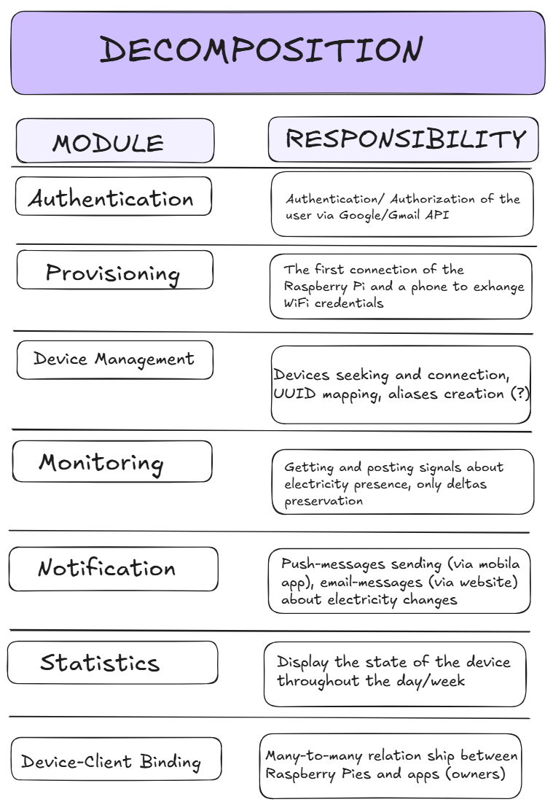
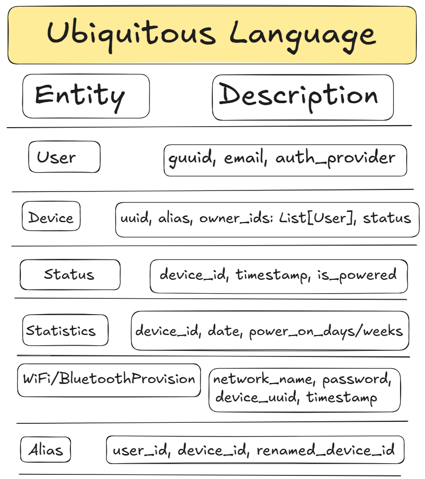
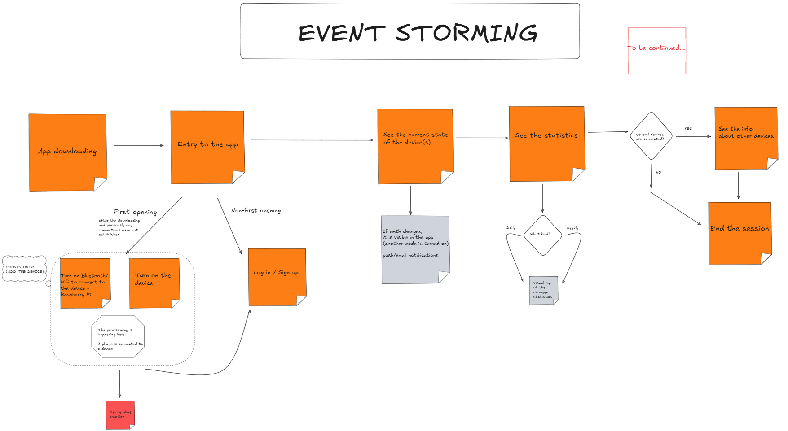
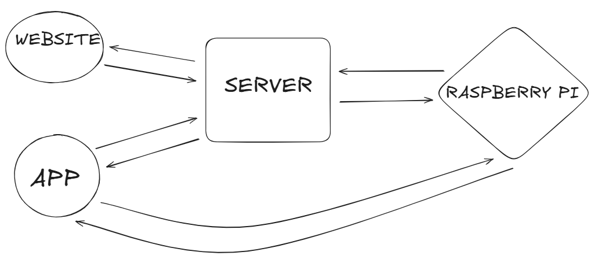
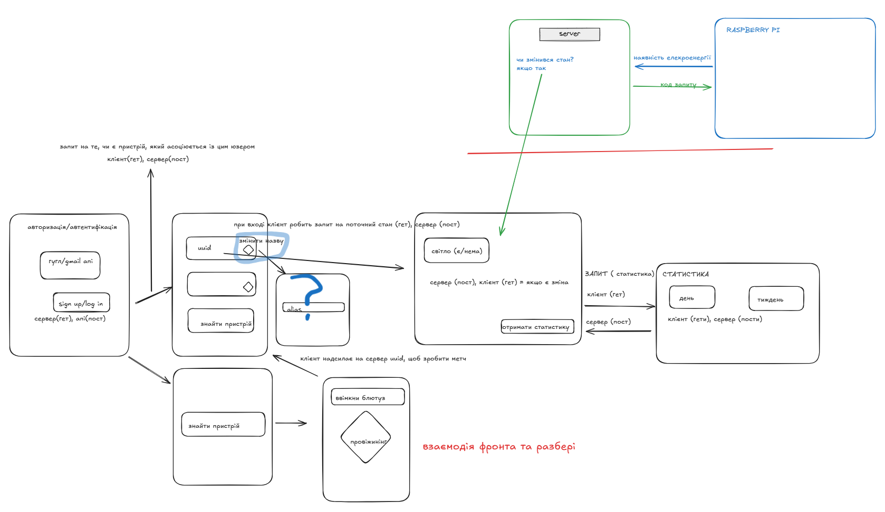

# ⚡ Electricity Bot

**Electricity Bot** is an IoT-based power outage detection system built with Raspberry Pi.  
Each device monitors power availability in real-time, helping users stay informed about outages in their homes and neighborhoods.

> This project includes a modular backend, mobile-first user interaction, and real-time event monitoring logic, structured according to RESTful and DDD principles.

---

## [Visual Representation of the Project](https://excalidraw.com/#room=c1a58f2ddfe6f8f34a55,co7pNAl0klx6bKR972ZfMg)

## Decomposition of the project and its Modules

> See the diagram below:

---

## Ubiquitous Language

> See visual overview:

---

## Event Storming

> See the event sequence flow:

---

## Context Cartography

> See context diagrams:
  

---
